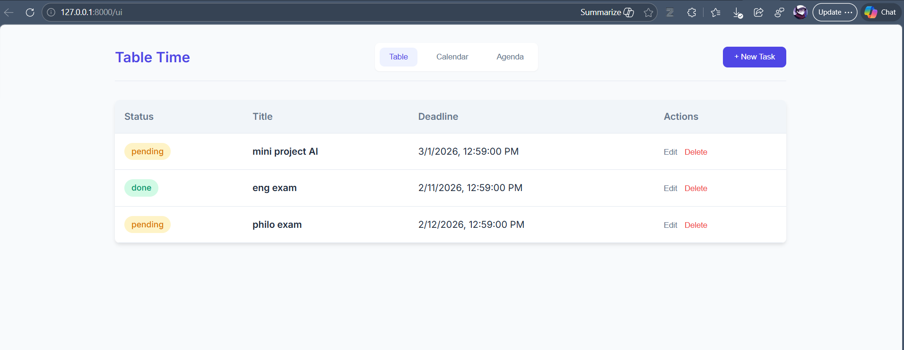
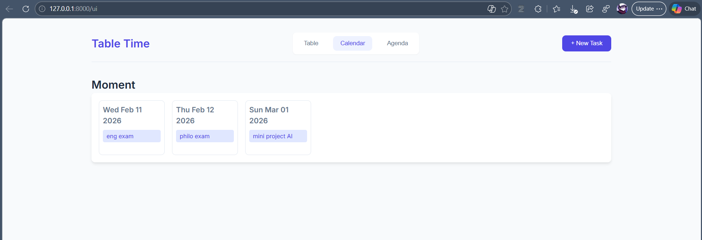
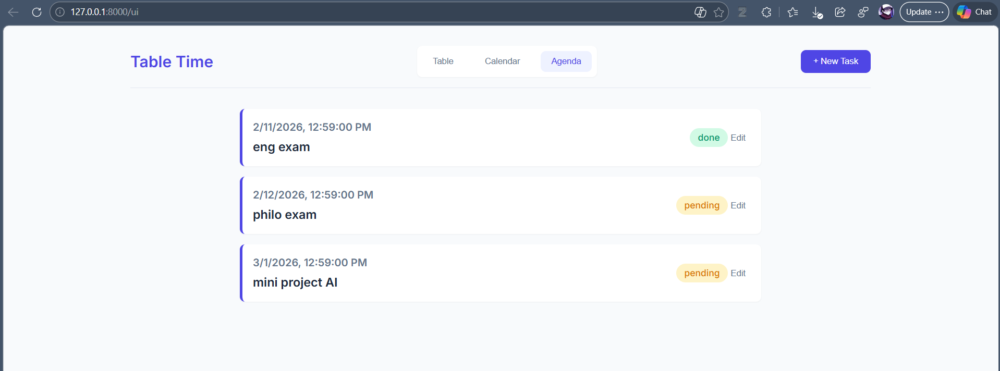

# Table Time

**Table Time** is a lightweight task management web application that allows you to organize tasks with deadlines in a **Table**, **Calendar**, and **Agenda** view. It is built with **FastAPI** for the backend, **SQLite** as the database, and **HTML/CSS + vanilla JavaScript** for the frontend.

---

## Features

- **Add, edit, delete tasks** with a title, description, deadline, and status (pending/done)
- **Table view** for an overview of tasks
- **Calendar view** for visual scheduling by date
- **Agenda view** for a chronological list of tasks
- Responsive and clean UI

---

## Tech Stack

- **Backend:** FastAPI, SQLAlchemy
- **Database:** SQLite
- **Frontend:** HTML, CSS, JavaScript (Vanilla)
- **Others:** Jinja2 Templates, CORS Middleware

---

## Screenshots

### Table View


### Calendar View


### Agenda View


---

## Installation

### Prerequisites
- Python 3.6+
- Git

### Steps

1. Clone the repository:

```bash
git clone https://github.com/Mira-Allali/Table_Time.git
cd table_time/backend
```
2. Create and activate a virtual environment:
```bash
python -m venv env
env\Scripts\activate   # Windows
# or
source env/bin/activate  # macOS/Linux
```
3. Install dependencies:
```bash
pip install -r requirements.txt
```
4. Start the server:
```bash
uvicorn main:app --reload
```
5. Open the app in your browser:
```bash
http://127.0.0.1:8000/ui
```
---
## Usage

- Click + New Task to add a task

- Navigate between Table, Calendar, and Agenda using the top buttons

- Edit or delete tasks using the buttons in each task row
---

## Optional: One-Click Launch (Windows)

- You can create a .exe to launch the app and open the UI automatically:
```bash
python launcher.py
```
(Use PyInstaller with --onefile --noconsole to create an executable.)

---
## Workflow for the Demo 

- Run the launcher or uvicorn backend.main:app --reload.

- Open the UI at /ui.

- Demonstrate adding, editing, and deleting tasks.

- Switch between Table, Calendar, and Agenda views.

- Show that all changes persist in the SQLite database.

## Contributing

- Fork the repository

- Create a new branch for your feature/fix

- Submit a pull request

---

## Author

Mira Allali  
PhD Researcher – Networks and Security
Berrached Assia | PhD Researcher – architecture
Cherki Asma Nada | PhD Researcher - english literature and civilisation
Mechache Hadil Hadjer| PhD Researcher - english language and culture
Mouharar Ahlam| PhD Researcher - english language and culture

---

## License

This repository is intended for academic and research purposes.
